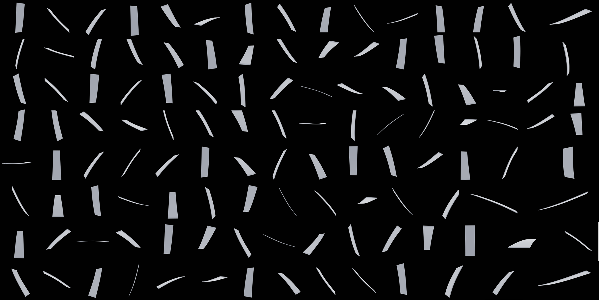
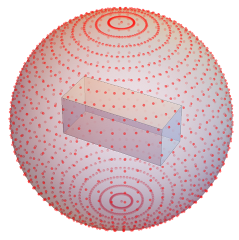

# 3DGEN
__A synthetic Mesh-Image-Depth dataset generation mehtod for civil structures__


<p align="center">
  
</p>

__IMPORTANT__
1. The repository contains purely Python code.
2. 3D mesh generation: The mesh generation utilizes Trimesh or supports prebuilt mesh files in formats such as .obj, .ply, and other popular formats.
3. Mesh rendering can be accessed at: <br>
   paper: https://arxiv.org/abs/2302.01721. <br>
   GitHub: https://github.com/TEXTurePaper/TEXTurePaper. <br>
   Hugging Face Spaces: https://huggingface.co/spaces/TEXTurePaper/TEXTure.
5. Image rendering: Image rendering can be achieved using either Pyrender(fast/low quality) or Blender(slow/high quality).
6. For metric depth estimation and 3D surface reconstruction, it's essential to use Blender.
7. some excellent works can be followed: <br>
   LeReS: https://github.com/aim-uofa/AdelaiDepth/tree/main/LeReS <br>
   MiDaS: https://github.com/isl-org/MiDaS <br>
8. For monocular vision based 3D mesh reconstruction, Pyrender can be used to generate multi-view images. 


# Dataset of Beams 
__A synthetic mesh-image dataset for beams in structure engineering__
The purpose of building up this dataset is for monocular image based 3D beam reconstruction.

The dataset can be download from the link below:

https://studentcurtinedu-my.sharepoint.com/:f:/g/personal/19286158_student_curtin_edu_au/EtEpgOtY_39NuN2aE_KzVNoB4z2lCml4SXTYn5ML7TfSmg?e=0oeSXV

There are three folders in the dataset: __3D_models__, __Deformed_3D_models__, __images__, __Depth_Maps__.


The generative 3D mesh texturing can be found from:

Paper: https://arxiv.org/abs/2302.01721

GitHub: https://github.com/TEXTurePaper/TEXTurePaper

Hugging face: https://huggingface.co/spaces/TEXTurePaper/TEXTure
# beams
This folder contains __400__ rectangular mesh cuboid beams generated by __Trimesh API__. The beams are generated based on the different ratio of length, width and height, in which some of them are 'fat' and some of them are 'thin'. More details:

__1. Calculate the ratio between length and width:__
The ratio between the length and width can be expressed as:
length : width = 1 : (0.25 to 0.02)
This means that the width can vary between 0.25 and 0.02 times the length.
And we genrate 20 different width based on the function below:

    widths = [max_rate  - (i / (num_rates - 1))**0.85 * (max_rate - min_rate) for i in range(num_rates)].

    In this dataset: max_rate = 0.25, min_rate = 0.02, num_rates = 20. 
    
__2. Calculate the ratio between width and height:__
Based on the width calculated in the previous step, we then determine the ratio between width and height. 20 ratios between the height and width, ranging from 0.05 to 1.5 are generated.

They are evenly distributed as:
```python
np.linspace(0.05, 1.5, 20).
```

The size of the beam can be found from the file: '/beams/mesh_meta'.

Each beam has __6147 vertices__ and __12288 face normals__.  

# simple_support_beam
This folder contains 7200 deformed simple support beams. These deformed beams are generated by applying the analytic solution of the simple support beam to the original beams defined in the 'beams' file. The analytic solusion:

```python
# P: the applied load.
# a: the location along the beam where the applied load or force P is acting. 
# E: Young's modulus of the material (E = 210000000000).
# I: the moment of inertia of the cross-sectional shape of the beam.

def simple_support_beam(mesh, Len=1, P, a, E, I):
    for vertic in mesh.vertices:
        x = vertic[0]
        if x < a:
            y = (P * (L - a) * x * (L**2 - x**2 - (L - a)**2)) / (6 * L * E * I)
        else:
            y = (P * a * (L - x) * (L**2 - (L - x)**2 - a**2)) / (6 * L * E * I)
        vertic[1] += y  # Add the deflection to the y-coordinate of the vertex
    return mesh
```
Before applying the load to the beams, desired loads are estimated. Input a desired displacement, the desired load can be estimated.

```python
# Length: Length of the beam.
# D_dis: desired displacement.
# E: Young's modulus of the material.
# I: the moment of inertia of the cross-sectional shape of the beam.
# a: the location along the beam where the applied load or force P is acting.
# Estimate the desired applied load given desired displacement

def power_estimation(Length, D_dis, E, I, a):
    D_power = int((6 * Length * E * I * D_dis) / (a * (Length - a) * (Length ** 2 - (Length - a) ** 2 - a ** 2)))
    return D_power
```

The load is applied at two locations along a beam: 0.25 and 0.5. For each of these locations, 9 different loads are applied based on the maximum displacement (0.05) and minimum displacement (0). This is because the displacement of a simple support beam is typically not very severe. In total, there are 18 loads, each of which generates a distinct mesh for the beam.

```python
locs = [0.25, 0.50]
num_mesh = 10
for loc in locs:
    D_power_max = power_estimation(Length, 0.05, E, I, loc)
    D_power_min = 0
    step = (D_power_max - D_power_min) // (num_mesh - 1)
    D_powers = [x for x in range(D_power_min, D_power_max, step)]
```

The meta information of the deformed beams can be found from file: './dataset/simple_support_beam/deformed_info.json'. 

- The top-level structure is a dictionary, where each key represents a __specific beam__. Each example within the deformed_info dictionary contains information about different load applying __locations__ along the beam.
  - Each location within an example is represented by a key, with the location value scaled by __100__ for clarity.
  - Within each location, there is information about different __"loads" or 'powers'__ applied to the beam. 
    - Within each power/load, there is a sub-dictionary containing specific information about the deformed beam.
      - The __"Path"__ key represents the file path where the deformed beam mesh is stored.
      - The __"E"__ key corresponds to Young's modulus.
      - The __"I"__ key represents the moment of inertia.
      
A tree diagram of the json file is shown below:
```python
root
├─ beam_0000
│  ├─ location 1
│  │  ├─ load 1
│  │  │  ├─ Path
│  │  │  ├─ E
│  │  │  └─ I
│  │  ├─ load 2
│  │  │  ├─ Path
│  │  │  ├─ E
│  │  │  └─ I
│  │  └─ ...
│  ├─ location 2
│  │  ├─ power1
│  │  │  ├─ Path
│  │  │  ├─ E
│  │  │  └─ I
│  │  ├─ power2
│  │  │  ├─ Path
│  │  │  ├─ E
│  │  │  └─ I
│  │  └─ ...
│  └─ ...
├─ beam_0001
│  ├─ ...
│  └─ ...
└─ ...
```

# simple_support_beam_images
The images of each deformed beam are rendered using the __Pyrender__ API and stored in this file. 

For each deformed beam, we generated 120 synthetic cameras to capture images __(1920x1920)__ of the deformed beam. The camera locations were randomly sampled from a sphere surrounding the beam. The visualization below shows the possible camera positions:

<p align="center">
  
</p>

This code below is used to generate random camera poses around a 3D object for rendering purposes.

- __Function rotation_matrix(roll, pitch, yaw)__: This function generates a rotation matrix given roll, pitch, and yaw angles. The rotation matrix is used to rotate the camera around the object. The rotation is done in the order of roll (rotation about the x-axis), pitch (rotation about the y-axis), and yaw (rotation about the z-axis).
- __Calculating the center and size of the mesh__: The center of the mesh is calculated as the mean of the mesh's bounds (the minimum and maximum coordinates of the mesh). The size of the mesh is calculated as the difference between the maximum and minimum coordinates of the mesh.
- __Defining the distance of the camera from the center of the mesh__: The distance of the camera from the center of the mesh is set to be the maximum dimension of the mesh plus the z-coordinate of the center. This ensures that the camera is positioned far enough from the object to capture it fully in the frame.
- __Generating random camera poses__: The code then enters a loop where it generates 120 random camera poses. For each pose, it randomly selects a yaw and pitch angle, and sets the roll angle to 0. It then calculates the position of the camera (eye) using these angles and the previously defined distance. The rotation matrix for the camera is calculated using the rotation_matrix(roll, pitch, yaw) function. Finally, the camera pose is constructed by setting the top-left 3x3 submatrix to the rotation matrix and the top-right 3x1 submatrix to the camera position. This 4x4 matrix represents the pose of the camera in homogeneous coordinates.

```python
# calculate the rotaion matrix of cameras based on roo, pitch and yaw angles.
def rotation_matrix(roll, pitch, yaw):
    R_x = np.array([[1, 0, 0],
                    [0, np.cos(roll), -np.sin(roll)],
                    [0, np.sin(roll), np.cos(roll)]])
    R_y = np.array([[np.cos(pitch), 0, np.sin(pitch)],
                    [0, 1, 0],
                    [-np.sin(pitch), 0, np.cos(pitch)]])
    R_z = np.array([[np.cos(yaw), -np.sin(yaw), 0],
                    [np.sin(yaw), np.cos(yaw), 0],
                    [0, 0, 1]])
    R = np.dot(R_z, np.dot(R_y, R_x))
    return R
    
# Get the center of the mesh
mesh = trimesh.load_mesh(path)
mesh = pyrender.Mesh.from_trimesh(mesh)
bounds = mesh.bounds
center = bounds.mean(axis=0)
size = bounds[1] - bounds[0]

# Define the distance of the camera from the center of the mesh
distance = np.max(size) + center[2]

#define intrisix matrix of the cameras
camera = pyrender.PerspectiveCamera(yfov=np.pi / 3.0)
    
for k in range(120):
    yaw = random.uniform(0, 2 * np.pi)  # random yaw angle
    pitch = random.uniform(0, np.pi)  # random pitch angle
    roll = 0  # you can change this as needed
    eye = center + distance * np.array([np.sin(pitch) * np.cos(yaw), np.sin(pitch) * np.sin(yaw), np.cos(pitch)])
    R = rotation_matrix(roll, pitch, yaw)
    camera_pose = np.eye(4)
    camera_pose[:3, :3] = R
    camera_pose[:3, 3] = eye
```
