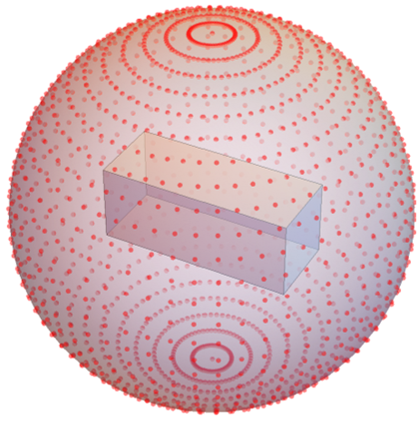

# Datasdet of Beams 
__A mesh-image dataset for beams in structure engineering__

The purpose of building up this dataset is for monocular image based 3D beam reconstruction.

The dataset can be download from the link below:

https://www.google.com/search?q=read+paper&rlz=1C1GCEA_enAU1032AU

There are three folders: __beams__, __simple_support_beam__ and __simple_support_beam_images__ in the dataset.
# beams
This folder contains __400__ rectangular mesh cuboid beams generated by __Trimesh API__. The beams are generated based on the different ratio of length, width and height, in which some of them are 'fat' and some of them are 'thin'. More details:

__1. Calculate the ratio between length and width:__
The ratio between the length and width can be expressed as:
length : width = 1 : (0.25 to 0.02)
This means that the width can vary between 0.25 and 0.02 times the length.
And we genrate 20 different width based on the function below:

    widths = [max_rate  - (i / (num_rates - 1))**0.85 * (max_rate - min_rate) for i in range(num_rates)].

    In this dataset: max_rate = 0.25, min_rate = 0.02, num_rates = 20. 
    
__2. Calculate the ratio between width and height:__
Based on the width calculated in the previous step, we then determine the ratio between width and height. 20 ratios between the height and width, ranging from 0.05 to 1.5 are generated.

They are evenly distributed as:
```python
np.linspace(0.05, 1.5, 20).
```

The size of the beam can be found from the file: '/beams/mesh_meta'.

Each beam has __6147 vertices__ and __12288 face normals__.  

# simple_support_beam
This folder contains 7200 deformed simple support beams. These deformed beams are generated by applying the analytic solution of the simple support beam to the original beams defined in the 'beams' file. The analytic solusion:

```python
# P: the applied load.
# a: the location along the beam where the applied load or force P is acting. 
# E: Young's modulus of the material (E = 210000000000).
# I: the moment of inertia of the cross-sectional shape of the beam.

def simple_support_beam(mesh, Len=1, P, a, E, I):
    for vertic in mesh.vertices:
        x = vertic[0]
        if x < a:
            y = (P * (L - a) * x * (L**2 - x**2 - (L - a)**2)) / (6 * L * E * I)
        else:
            y = (P * a * (L - x) * (L**2 - (L - x)**2 - a**2)) / (6 * L * E * I)
        vertic[1] += y  # Add the deflection to the y-coordinate of the vertex
    return mesh
```
Before applying the load to the beams, desired loads are estimated. Input a desired displacement, the desired load can be estimated.

```python
# Length: Length of the beam.
# D_dis: desired displacement.
# E: Young's modulus of the material.
# I: the moment of inertia of the cross-sectional shape of the beam.
# a: the location along the beam where the applied load or force P is acting.
# Estimate the desired applied load given desired displacement

def power_estimation(Length, D_dis, E, I, a):
    D_power = int((6 * Length * E * I * D_dis) / (a * (Length - a) * (Length ** 2 - (Length - a) ** 2 - a ** 2)))
    return D_power
```

The load is applied at two locations along a beam: 0.25 and 0.5. For each of these locations, 9 different loads are applied based on the maximum displacement (0.05) and minimum displacement (0). This is because the displacement of a simple support beam is typically not very severe. In total, there are 18 loads, each of which generates a distinct mesh for the beam.

```python
locs = [0.25, 0.50]
num_mesh = 10
for loc in locs:
    D_power_max = power_estimation(Length, 0.05, E, I, loc)
    D_power_min = 0
    step = (D_power_max - D_power_min) // (num_mesh - 1)
    D_powers = [x for x in range(D_power_min, D_power_max, step)]
```

The meta information of the deformed beams can be found from file: './dataset/simple_support_beam/deformed_info.json'. 

- The top-level structure is a dictionary, where each key represents a __specific beam__. Each example within the deformed_info dictionary contains information about different load applying __locations__ along the beam.
  - Each location within an example is represented by a key, with the location value scaled by __100__ for clarity.
  - Within each location, there is information about different __"loads" or 'powers'__ applied to the beam. 
    - Within each power/load, there is a sub-dictionary containing specific information about the deformed beam.
      - The __"Path"__ key represents the file path where the deformed beam mesh is stored.
      - The __"E"__ key corresponds to Young's modulus.
      - The __"I"__ key represents the moment of inertia.
      
A tree diagram of the json file is shown below:
```python
root
├─ beam_0000
│  ├─ location 1
│  │  ├─ load 1
│  │  │  ├─ Path
│  │  │  ├─ E
│  │  │  └─ I
│  │  ├─ load 2
│  │  │  ├─ Path
│  │  │  ├─ E
│  │  │  └─ I
│  │  └─ ...
│  ├─ location 2
│  │  ├─ power1
│  │  │  ├─ Path
│  │  │  ├─ E
│  │  │  └─ I
│  │  ├─ power2
│  │  │  ├─ Path
│  │  │  ├─ E
│  │  │  └─ I
│  │  └─ ...
│  └─ ...
├─ beam_0001
│  ├─ ...
│  └─ ...
└─ ...
```

# simple_support_beam_images
<p align="center">
  
</p>
s
